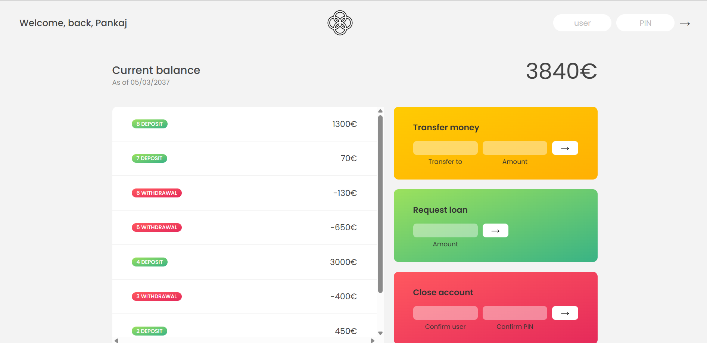

# 🏦 Bankish App

<h3>Bankish App Preview </h3>
 

Bankist App is a JavaScript-based banking application that I developed as part of the Jonas Schmedtmann's JavaScript course. It allows users to manage their accounts, perform various banking operations, and experience a seamless and secure online banking experience.

## Features

- 🔐 **User Authentication**: Secure user authentication and login process.
- 📊 **Account Overview**: View account balances, transaction history, and other details.
- 💸 **Transfer Money**: Transfer funds between your own accounts and to other users.
- 💰 **Request Loan**: Request a loan from the bank based on your account history.
- 🚪 **Close Account**: Close your account and terminate your banking relationship.

## Demo

A live demo of the Bankist App can be found [here](bankish-web.netlify.app).

Please note that the live demo may not show the console for security reasons.

## Technologies Used

- HTML
- CSS
- JavaScript
- [Font Awesome](https://fontawesome.com/) (for icons)

## Setup

You can access the app profiles with the following usernames and PINs:

### Pankaj Kanojia 

- 👤 Username: `pk`
- 🔐 PIN: `1111`

### Jessica Davis

- 👤 Username: `jd`
- 🔐 PIN: `2222`

### Steven Thomas Williams

- 👤 Username: `stw`
- 🔐 PIN: `3333`

### Sarah Smith

- 👤 Username: `ss`
- 🔐 PIN: `4444`
